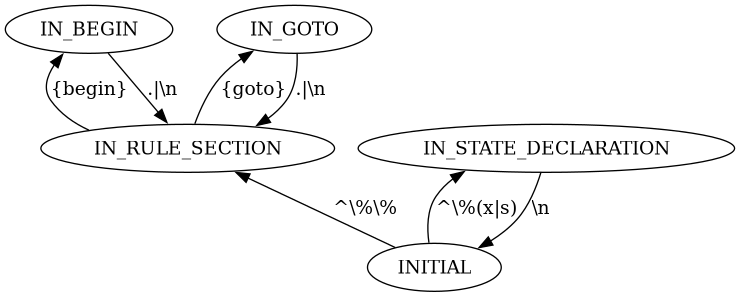

# Allegra
> Source code visualizer using graphs

Depgra is capable of creating C/C++ header file inclusion graphs.

Flexgra is capable of creating Flex state-transition graphs.

Allegra is a small wrapper around the above utilities.

## Examples
`source/flexgra.l` rendering itself:

`debug/dummy_c_project/'` under GNU:

The same, but MUSL:

